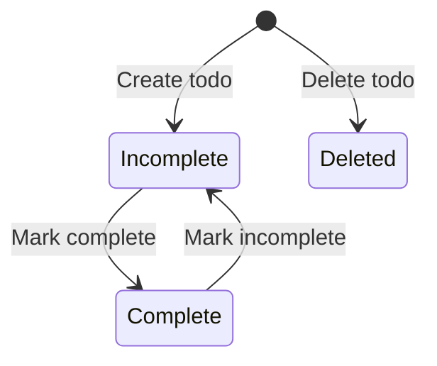

# Data Model: Todo CLI Application

**Feature**: 001-todo-cli-app
**Date**: 2025-12-31

## Entities

### Todo

Represents a single task item in the todo list.

#### Fields

| Field | Type | Constraints | Description |
|-------|------|-------------|-------------|
| `id` | integer | auto-increment, unique | Unique identifier for the todo within session |
| `title` | string | required, 1-200 chars | Brief description of the task |
| `description` | string | optional, 0-1000 chars | Detailed information about the task |
| `completed` | boolean | default: False | Completion status of the task |

#### State Transitions



#### Validation Rules

- Title MUST be non-empty (at least 1 character)
- Title MUST NOT exceed 200 characters
- Description CAN be empty (None or "")
- Description SHOULD NOT exceed 1000 characters if provided
- ID is assigned by system and never user-provided
- completed starts as False for new todos

#### Relationships

- Todo instances are stored in `TodoStore` (in-memory collection)
- No foreign key relationships (single collection, no dependencies)

## Storage

### TodoStore

In-memory storage container for Todo instances.

#### Structure

```python
{
    "todos": Dict[int, Todo],  # id -> Todo mapping
    "next_id": int             # Auto-increment counter
}
```

#### Invariants

- All IDs in `todos` keys MUST be unique
- `next_id` MUST be greater than all existing IDs
- No duplicate todos (by identity, not content)

#### Operations

| Operation | Time Complexity | Description |
|-----------|-----------------|-------------|
| add(todo) | O(1) | Insert new todo, increment counter |
| get(id) | O(1) | Retrieve todo by ID |
| update(todo) | O(1) | Update existing todo |
| delete(id) | O(1) | Remove todo by ID |
| list_all() | O(n) | Return all todos |
